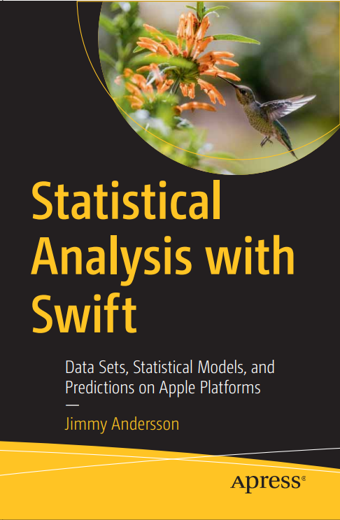
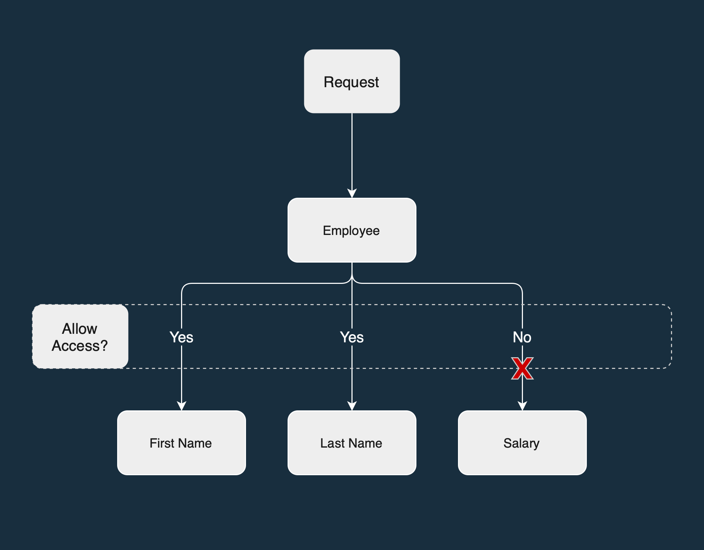

  

## Who Am I?
A curious, driven, and independent person who can quickly get up to speed and deliver value in a company’s software development process. With a background in software engineering and data science, I am well-equipped to help your organization with requirements, design, implementation, and deployment of data-driven and machine learning-powered applications.

Outside of work, I also have an inherent passion for taking on personal projects. StatKit is an open-source collection of statistical analysis tools I develop for the Swift community, and I also published the book "Statistical Analysis with Swift" on Apress Media in 2021.

 

## My Technology Buzzwords
#### Programming Languages
<table>
  <tr align=center>
    <td width=120px>
      
    </td>
    <td width=120px>
      
    </td>
    <td width=120px>
      
    </td>
  </tr>
  <tr align=center>
    <td width=120px>Swift</td>
    <td width=120px>Python</td>
    <td width=120px>Java</td>
  </tr>
</table>

#### Data Storage
<table>
  <tr align=center>
    <td width=120px></td>
    <td width=120px></td>
  </tr>
  <tr align=center>
    <td width=120px>PostgreSQL</td>
    <td width=120px>SQLite</td>
  </tr>
</table>

#### Data Streaming & Processing
<table>
  <tr align=center>
    <td width=120px></td>
    <td width=120px></td>
    <td width=120px></td>
  </tr>
  <tr align=center>
    <td width=120px>Apache Flink</td>
    <td width=120px>Apache Airflow</td>
    <td width=120px>Apache Kafka</td>
  </tr>
</table>

#### DevOps / Cloud Tools
<table>
  <tr align=center>
    <td width=120px></td>
    <td width=120px></td>
    <td width=120px></td>
  </tr>
  <tr align=center>
    <td width=120px>Docker</td>
    <td width=120px>Kubernetes</td>
    <td width=120px>Git</td>
  </tr>
</table>

#### Operating Systems
<table>
  <tr align=center>
    <td width=120px></td>
    <td width=120px></td>
  </tr>
  <tr align=center>
    <td width=120px>macOS</td>
    <td width=120px>Linux</td>
  </tr>
</table>

 

## Current Projects
<table style="width:100%">
  <tr>
    <th rowspan=2 width=120px>
      
    </th>
    <th align="left">
      <a href="https://github.com/JimmyMAndersson/StatKit">StatKit</a>
    </th>
  </tr>
  <tr>
    <td align="left">
      <i>A collection of statistical analysis tools for Swift developers</i>
    </td>
  </tr>
</table>

 

## Publications
<table style="width:100%">
  <tr>
    <th rowspan=2 width=120px>
      
    </th>
    <th align="left" height=50%>
      <a href="http://link.springer.com/book/10.1007/978-1-4842-7765-2">Statistical Analysis with Swift</a>
    </th>
  </tr>
  <tr>
    <td align="left">
      <i>Published by Apress Media, 2021</i>
    </td>
  </tr>

  <tr>
    <th rowspan=2 width=120px>
      
    </th>
    <th align="left" height=50%>
      <a href="https://hdl.handle.net/20.500.12380/305121">Attribute-Based Content Redaction in Large-Scale Data Systems A Study of Granular Access Control</a>
    </th>
  </tr>
  <tr style="border:0">
    <td align="left">
      <i>Published by Chalmers University of Technology, 2022</i>
    </td>
  </tr>
</table>

 

## Contact

  <table>
    <tr>
      <th>Email</th>
      <td align="center">hello [at] applyn.se</td>
    </tr>
    <tr>
      <th>LinkedIn</th>
      <td align="center"><a href="https://www.linkedin.com/in/jmandersson">Jimmy M Andersson</a></td>
    </tr>
  </table>

  

