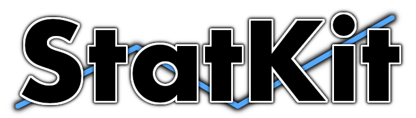

  

## Who Am I?
Being a curious and driven person, I earned my M.Sc in Data Science and AI, and my B.Sc. in Software Engineering at Chalmers University of Technology. The same traits also led me to work with data acquisition and visualization outside my studies. I have performed my main work on mobile devices that impose constraints on processing capabilities, memory, and battery life.

Outside of work, I also have an inherent passion for taking on personal projects. StatKit is an open-source collection of statistical analysis tools I develop for the Swift community. In 2021, I also published "Statistical Analysis with Swift" on Apress Media.

Keeping track and staying on schedule with work, studies, and personal projects have required me to be organized, focused, and tolerant of stress. I bring these qualities to my work in my pursuit to achieve the results that my employer and I want to see.

  
## My Technology Buzzwords
<table style="width:100%">
  <tr style="border:0">
    <th style="border:0" width=120px></th>
    <th style="border:0" width=120px></th>
    <th style="border:0" width=120px></th>
  </tr>
  <tr style="border:0">
    <th style="border:0" width=120px>Swift</th>
    <th style="border:0" width=120px>Python</th>
    <th style="border:0" width=120px>Docker</th>
  </tr>
  <tr style="border:0">
    <th style="border:0" width=120px></th>
    <th style="border:0" width=120px></th>
    <th style="border:0" width=120px></th>
  </tr>
  <tr style="border:0">
    <th style="border:0" width=120px>Spark</th>
    <th style="border:0" width=120px>PostgreSQL</th>
    <th style="border:0" width=120px>Git</th>
  </tr>
</table>

  
## Current Projects
<table style="width:100%">
  <tr style="border:0">
    <th style="border:0" rowspan=2 width=120px></th>
    <th style="border:0"><a href="https://github.com/JimmyMAndersson/StatKit">StatKit</a></th>
  </tr>
  <tr style="border:0">
    <td style="border:0"><i>A collection of statistical analysis tools for Swift developers</i></td>
  </tr>
</table>

  
## Publications
<table style="width:100%">
  <tr style="border:0">
    <th style="border:0" rowspan=2 width=120px></th>
    <th style="border:0" height=50%><a href="http://link.springer.com/book/10.1007/978-1-4842-7765-2">Statistical Analysis with Swift</a></th>
  </tr>
  <tr style="border:0">
    <td style="border:0"><i>Published on Apress Media, 2021</i></td>
  </tr>
</table>

  
## Contact

  <table>
    <tr>
      <th>Email</th>
      <td align="center">dev [at] applyn.se</td>
    </tr>
    <tr>
      <th>LinkedIn</th>
      <td align="center"><a href="https://www.linkedin.com/in/jmandersson">Jimmy M Andersson</a></td>
    </tr>
    <tr>
      <th>Twitter</th>
      <td align="center"><a href="https://twitter.com/JimmyMAndersson">@JimmyMAndersson</a></td>
    </tr>
  </table>

